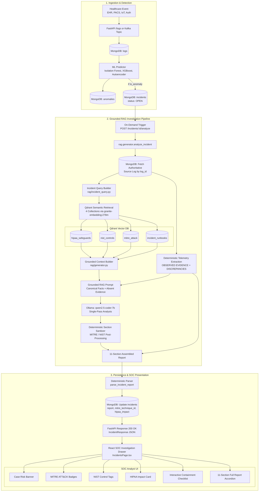

# 🏥 HAI-SOC — Healthcare AI Security Operations Platform

> **An AI-powered Security Operations Center (SOC) platform designed for healthcare environments. Combines multi-source security log ingestion, ML anomaly detection, grounded RAG knowledge retrieval across HIPAA, NIST, and MITRE ATT&CK, and local LLM incident investigation reports with interactive SOC response workflows.**

---

## 📑 Table of Contents
1. [Overview](#-overview)
2. [Implemented System Architecture](#-implemented-system-architecture)
3. [RAG Incident Analysis Pipeline](#-rag-incident-analysis-pipeline)
4. [Authoritative Knowledge Base](#-authoritative-knowledge-base)
5. [AI Incident Report Structure](#-ai-incident-report-structure)
6. [R10.2 RAG Evaluation Framework](#-r102-rag-evaluation-framework)
7. [R11 End-to-End SOC Integration](#-r11-end-to-end-soc-integration)
8. [Machine Learning Anomaly Detection](#-machine-learning-anomaly-detection)
9. [Technology Stack](#-technology-stack)
10. [REST API Reference](#-rest-api-reference)
11. [Setup and Execution Guide](#-setup-and-execution-guide)
12. [Current Limitations & Known Gaps](#-current-limitations--known-gaps)
13. [Project Status](#-project-status)
14. [Author & License](#-author--license)

---

## 🌟 Overview

Healthcare IT environments generate vast volumes of security telemetry across Electronic Health Record (EHR) systems, Picture Archiving and Communication Systems (PACS), Medical IoT devices, authentication endpoints, and perimeter firewalls. Traditional rule-based SIEMs struggle with high false-positive alert fatigue and lack domain-specific regulatory and threat intelligence context.

**HAI-SOC** addresses this challenge by providing an end-to-end pipeline:
1. **Ingestion & Storage**: Ingests 13-field normalized healthcare security logs into MongoDB and Kafka streams.
2. **ML Anomaly Scoring**: Evaluates events using 5 benchmarked machine learning anomaly detectors (XGBoost, Isolation Forest, Autoencoder, One-Class SVM, LOF).
3. **Automated Incident Creation**: Generates prioritized incident cases when anomalies cross confidence thresholds.
4. **Grounded RAG Investigation**: Retrieves relevant regulatory safeguards (HIPAA), security controls (NIST SP 800-53), adversary tactics (MITRE ATT&CK), and internal clinical playbooks from a Qdrant vector database using `granite-embedding:278m`.
5. **AI Report Synthesis**: Utilizes local `qwen2.5-coder:7b` via Ollama to generate comprehensive, grounded 11-section incident reports with deterministic telemetry extraction and sanity checks.
6. **Analyst Workflow UI**: Renders an interactive React SOC dashboard with MITRE badges, NIST control tags, HIPAA compliance impact analysis, and interactive containment checklists.

---

## 🏛 Implemented System Architecture



---

## 🔍 RAG Incident Analysis Pipeline

The RAG subsystem (`rag/`) is designed with a strict **grounding-first architecture** to prevent LLM hallucinations:

1. **Incident Selection & Authoritative Correlation**:
   The backend retrieves the incident record from MongoDB and fetches the exact authoritative raw telemetry log via `incident.log_id`.
2. **Query Extraction (`rag/incident_query.py`)**:
   Extracts clinical action tokens, department context, protocols, and anomaly characteristics to construct structured vector search queries.
3. **Multi-Collection Retrieval (`rag/retriever.py`)**:
   Executes semantic similarity search against 4 dedicated Qdrant collections using Ollama `granite-embedding:278m` (768 dimensions):
   - `hipaa_safeguards`
   - `nist_controls`
   - `mitre_attack`
   - `incident_runbooks`
4. **Negative Evidence & Boundary Enforcement**:
   The prompt generator (`build_rag_prompt`) constructs a strict negative context block (`build_absent_evidence`) instructing the model that absent evidence (e.g., lack of external destination or lack of ransomware note) must **never** be assumed or fabricated.
5. **Single-Pass LLM Analysis (`rag/generator.py`)**:
   Sends the canonical facts and retrieved domain knowledge to local `qwen2.5-coder:7b` via Ollama for analysis-only generation.
6. **Deterministic Assembly & Post-Processing**:
   - `OBSERVED EVIDENCE` and `IMPORTANT DATA DISCREPANCIES` are formatted **100% deterministically by Python** from raw database logs.
   - `sanitize_mitre_section()` strips unverified MITRE techniques (e.g. rejecting `T1567` for internal IP destinations, rejecting `T1002` when compression is false).
   - `sanitize_nist_section()` ensures only retrieved NIST controls appear in output.
7. **Deterministic Extraction & Persistence**:
   The backend deterministic parser extracts MITRE IDs, NIST controls, HIPAA text, and action lists, persisting them into MongoDB.

---

## 📚 Authoritative Knowledge Base

All reference documentation in `knowledge_base/` is structured with YAML frontmatter:

| Category | Directory | Authoritative Documents | Description |
|:---|:---|:---|:---|
| **HIPAA** | `knowledge_base/hipaa/` | `technical_safeguards.md`<br>`administrative_safeguards.md`<br>`breach_notification.md` | 45 CFR Part 164 Security & Privacy Rules (Access Control § 164.312(a), Audit Controls § 164.312(b), Breach Notification § 164.402). |
| **NIST** | `knowledge_base/nist/` | `access_control.md`<br>`audit_accountability.md`<br>`identification_authentication.md`<br>`incident_response.md` | NIST SP 800-53 Rev. 5 control baselines mapped to healthcare systems (AC-2, AC-3, AC-6, AU-2, AU-6, IA-2, IR-4, IR-5). |
| **MITRE ATT&CK** | `knowledge_base/mitre/` | `T1078_valid_accounts.md`<br>`T1486_data_encrypted_for_impact.md`<br>`T1567_exfiltration.md` | Enterprise ATT&CK techniques detailing adversary procedures, required telemetry preconditions, and mitigation strategies. |
| **Runbooks** | `knowledge_base/runbooks/` | `credential_theft.md`<br>`phi_exfiltration.md`<br>`ransomware.md` | Internal HAI-SOC operational procedures for containment, evidence preservation, clinical continuity, and regulatory reporting. |

---

## 📋 AI Incident Report Structure

The generated report contains **11 standardized sections**:

```text
INCIDENT SUMMARY
OBSERVED EVIDENCE
IMPORTANT DATA DISCREPANCIES
WHY THE EVENT IS SUSPICIOUS
UNKNOWN / REQUIRES INVESTIGATION
HIPAA IMPLICATIONS
RELEVANT MITRE ATT&CK TECHNIQUES
RELEVANT NIST CONTROLS
RECOMMENDED INVESTIGATION STEPS
RECOMMENDED CONTAINMENT ACTIONS
ANALYST ASSESSMENT
```

### Stored MongoDB Schema (`report` field)
```json
{
  "report": {
    "raw_markdown": "INCIDENT SUMMARY\n...",
    "generated_at": "2026-08-19T13:00:28.000Z",
    "mitre_techniques": ["T1078"],
    "nist_controls": ["AC-3", "AU-6", "IA-2"],
    "hipaa_impact": "This event may require a HIPAA breach assessment...",
    "risk_assessment": "CRITICAL",
    "recommended_actions": [
      "Block outbound traffic at perimeter firewall",
      "Revoke active PACS sessions for user USR010"
    ],
    "status": "GENERATED"
  },
  "mitre_technique_id": "T1078",
  "hipaa_impact": "This event may require a HIPAA breach assessment..."
}
```

---

## 🧪 R10.2 RAG Evaluation Framework

HAI-SOC includes an automated evaluation framework (`rag/evaluation/`) testing 6 controlled clinical scenarios:

| Test ID | Scenario Name | Description | Key Grounding Rules Checked |
|:---|:---|:---|:---|
| **`TEST-01`** | **Normal PHI Export** | Routine PACS export by doctor during business hours | Zero MITRE techniques; confirm TPO exception; no breach claim. |
| **`TEST-02`** | **Off-Hours PHI Export** | 150 records exported at 01:30 to internal `PACS_Server` | Detect severity discrepancy; reject `T1567` (internal destination). |
| **`TEST-03`** | **Authentication Anomaly** | Successful login after 5 failed attempts at 03:15 | Map `T1078` (Valid Accounts); map `IA-2` & `AC-2`. |
| **`TEST-04`** | **External Exfiltration** | 500 records (50 MB) sent to unapproved external web domain | Map `T1567` (Exfiltration Over Web Service); trigger breach assessment. |
| **`TEST-05`** | **Ransomware Impact** | 12,500 files modified with encryption and ransom note on SMB | Map `T1486` (Data Encrypted for Impact); isolate storage. |
| **`TEST-06`** | **Large Transfer (No Comp.)** | 1,000 DICOM images (200 MB) with `compression_detected = False` | Reject `T1002` (Data Compression); recognize DICOM raw size. |

Run the evaluation suite:
```bash
# Run all evaluation scenarios
python -m rag.evaluation.run_evaluation --all

# Run an individual scenario
python -m rag.evaluation.run_evaluation --test TEST-01
```

---

## 🔗 R11 End-to-End SOC Integration

Phase R11 connects the RAG subsystem directly into FastAPI and the React SOC Dashboard:

- **On-Demand Analysis**: Analysts trigger report generation via `POST /api/v1/incidents/{incident_id}/analyze`.
- **Database-Only Retrieval**: `GET /api/v1/incidents/{incident_id}` retrieves the persisted report from MongoDB in `< 5ms` without invoking the LLM.
- **Interactive SOC Drawer**:
  - **Status & Risk Banner**: Displays detector confidence score and severity level.
  - **MITRE Badges & NIST Tags**: Clickable/visual intelligence tags extracted from the report.
  - **HIPAA Compliance Warning**: Specific citations to 45 CFR safeguards.
  - **Interactive Checklist**: Toggleable containment checkboxes with strike-through states for analyst tracking.
  - **Collapsible Report Accordion**: Full 11-section grounded AI report view.

---

## 🤖 Machine Learning Anomaly Detection

Trained and benchmarked on synthetic healthcare security telemetry:

| Model | Type | Precision | Recall | F1-Score | ROC-AUC | False Positive Rate |
|:---|:---|:---:|:---:|:---:|:---:|:---:|
| **XGBoost** | Supervised | 1.000 | 1.000 | 1.000 | 1.000 | 0.000 |
| **Isolation Forest** | Unsupervised | 0.944 | 0.531 | 0.680 | 0.900 | 0.003 |
| **AutoEncoder** | Unsupervised | 0.850 | 0.531 | 0.654 | 0.866 | 0.008 |
| **One-Class SVM** | Unsupervised | 0.875 | 0.438 | 0.583 | 0.810 | 0.006 |
| **LOF** | Unsupervised | 0.192 | 0.313 | 0.238 | 0.740 | 0.117 |

---

## 💻 Technology Stack

| Layer | Technologies Used |
|:---|:---|
| **Backend API** | Python 3.11+, FastAPI, Pydantic v2, Uvicorn |
| **Database** | MongoDB (Collections: `logs`, `anomalies`, `incidents`, `users`), PyMongo |
| **Vector DB & Embeddings** | Qdrant (`localhost:6333`), Ollama `granite-embedding:278m` (768 dimensions) |
| **Generative AI & LLM** | Ollama (`localhost:11434`), `qwen2.5-coder:7b` |
| **Machine Learning** | Scikit-learn, XGBoost, PyOD, Pandas, NumPy |
| **Event Streaming** | Apache Kafka, `kafka-python` (Topic: `healthcare-security-logs`) |
| **Frontend UI** | React 19, TypeScript, Vite, Tailwind CSS v4, Lucide React, Recharts, Axios |
| **Authentication** | JWT (JSON Web Tokens), OAuth2 Password Bearer, Passlib/Bcrypt |

---

## 📡 REST API Reference

Interactive API documentation available at `http://localhost:8000/docs`.

### Incidents Endpoints
| Method | Endpoint | Description |
|:---|:---|:---|
| `GET` | `/incidents` | List all security incidents. |
| `GET` | `/incidents/{incident_id}` | Retrieve a specific incident with its persisted AI report (Database-only). |
| `POST` | `/incidents` | Manually create an incident case (SOC Analyst / Admin). |
| `PATCH` | `/incidents/{incident_id}` | Update incident status (`OPEN`, `INVESTIGATING`, `CONTAINED`, `RESOLVED`, `CLOSED`), risk level, or notes. |
| `DELETE` | `/incidents/{incident_id}` | Delete an incident (Admin only). |
| `POST` | `/incidents/{incident_id}/analyze` | **Trigger on-demand grounded RAG analysis** and save report to MongoDB. |

### Logs & Dashboard Endpoints
| Method | Endpoint | Description |
|:---|:---|:---|
| `GET` | `/logs` | List ingested healthcare security logs with pagination & filtering. |
| `POST` | `/logs` | Ingest a new normalized security log event. |
| `GET` | `/dashboard/overview` | Fetch high-level SOC dashboard metrics. |
| `GET` | `/dashboard/risk-distribution` | Retrieve incident risk breakdown. |
| `GET` | `/dashboard/anomaly-trend` | Fetch daily anomaly detection trends. |
| `GET` | `/health` | API and database health check. |

---

## 🚀 Setup and Execution Guide

### Prerequisites
1. **Python 3.11+**
2. **Node.js 18+ & npm**
3. **MongoDB** running locally on port `27017`
4. **Qdrant** running locally on port `6333`
5. **Ollama** running locally on port `11434` with required models:
   ```bash
   ollama pull qwen2.5-coder:7b
   ollama pull granite-embedding:278m
   ```

### 1. Backend Setup
```bash
# Clone the repository
git clone https://github.com/Shourya2812/HAI-SOC.git
cd HAI-SOC

# Create and activate virtual environment
python -m venv backend/.venv
# Windows:
backend\.venv\Scripts\activate
# macOS/Linux:
source backend/.venv/bin/activate

# Install dependencies
pip install -r backend/requirements.txt

# Start FastAPI backend
uvicorn backend.app.main:app --host 127.0.0.1 --port 8000 --reload
```

### 2. Frontend Setup
```bash
cd frontend

# Install dependencies
npm install

# Start Vite development server
npm run dev
# Dashboard accessible at http://localhost:3000
```

### 3. Running Verification & Tests
```bash
# Run backend R11 unit tests
python -m unittest tests/test_r11_incident_rag.py

# Run R10.2 RAG Grounding & Compliance evaluation
python -m rag.evaluation.run_evaluation --all

# Run live E2E MongoDB to RAG integration check
python -m tests.test_e2e_r11

# Build frontend production bundle
cd frontend && npm run build
```

---

## ⚠️ Current Limitations & Known Gaps

1. **Local LLM Latency**: Generating an AI report with local `qwen2.5-coder:7b` takes ~24–35 seconds on an RTX 3050 GPU; report generation is therefore kept **explicitly on-demand** rather than blocking synchronous Kafka stream ingestion.
2. **Synchronous Generation**: The `POST /analyze` endpoint runs synchronously during the HTTP request. Asynchronous background task workers (e.g. Celery / Redis queue) are queued for future production scaling.
3. **UI Placeholder Tabs**: Standalone views for `HIPAA Checklist`, `MITRE Navigator`, and `Playbooks Library` are currently placeholder routes; their data is actively served inside the **Incident Investigation Drawer**.
4. **Research / Prototype Scope**: HAI-SOC is an AI-assisted SOC investigation and research prototype; it does not replace certified legal or compliance counsel for formal HIPAA breach notifications.

---

## 📌 Project Status

### ✅ Completed Milestones
- [x] Common 13-field healthcare security log normalization & schema.
- [x] MongoDB database layer with idempotency indexes across logs, anomalies, and incidents.
- [x] Synthetic healthcare security log generator with 5 clinical attack injectors.
- [x] 5-Model ML anomaly detection benchmark (Isolation Forest, XGBoost, Autoencoder, One-Class SVM, LOF).
- [x] Authoritative Knowledge Base for HIPAA Safeguards, NIST SP 800-53, MITRE ATT&CK, and Internal Runbooks.
- [x] Qdrant vector retrieval with `granite-embedding:278m` across 4 collections.
- [x] Grounded RAG generator (`rag/generator.py`) with deterministic telemetry extraction, discrepancy detection, and MITRE/NIST sanitization.
- [x] Controlled RAG Evaluation Framework (`TEST-01` to `TEST-06`).
- [x] Phase R11 End-to-End integration: FastAPI `POST /incidents/{id}/analyze`, report persistence, and React SOC investigation drawer with containment checklists.

### 🚧 Future & Planned Roadmap
- [ ] Celery / Redis background worker for asynchronous report generation queues.
- [ ] Dedicated UI knowledge base explorers (interactive MITRE matrix & HIPAA safeguard browser).
- [ ] Wazuh HIDS log ingestion agent integration.
- [ ] Containerized multi-service deployment with Docker Compose & Kubernetes Helm charts.
- [ ] Prometheus metrics exporter & Grafana monitoring dashboards.

---

## 👨‍💻 Author & License

**Shourya Tiwari**
Computer Science Engineering (Cybersecurity), Manipal Institute of Technology
*Project Repository*: [https://github.com/Shourya2812/HAI-SOC](https://github.com/Shourya2812/HAI-SOC)